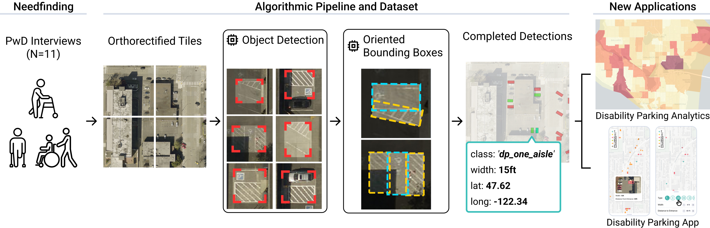

<p align="center">

  <h1 align="center">"Where Can <em>I</em> Park?" Understanding Human Perspectives and
Scalably Detecting Disability Parking from Aerial Imagery</h1>
  <p align="center">
    Jared Hwang<sup>*</sup>, 
    Chu Li<sup>*</sup>,
    Hanbyul Kang<sup>*</sup>,
    Maryam Hosseini<sup>&dagger;</sup>,
    Jon E. Froehlich<sup>*</sup>
    <br><br>
    <sup>*</sup> University of Washington
    <br>
    <sup>&dagger;</sup> City and Regional Planning, UC Berkeley
  </p>
  <h3 align="center"><a href="https://github.com/makeabilitylab/AccessParkCV">💻 Code</a> • <a href="https://makeabilitylab.cs.washington.edu/media/publications/Hwang_WhereCanIParkUnderstandingHumanPerspectivesAndScalablyDetectingDisabilityParkingFromAerialImagery_ASSETS2025.pdf">📄 Paper</a>  • <a href="https://huggingface.co/datasets/makeabilitylab/disabilityparking">🗃️ Dataset</a> 
  </h3>
  <div align="center"></div>
</p>
<p align="center">
  <a href="">
    
  </a>
</p>
<p>
<strong>AccessParkCV</strong> is a deep learning pipeline that detects and characterizes the width of disability parking spaces from orthorectified aerial imagery. We also include a dataset of 7,069 labeled parking spaces (and 4,693 labeled access aisles). AccessParkCV achieves a micro-F1=0.89, demonstrating how our pipeline can support new urban analytics and end-user tools. In this repo, we include code for using AccessParkCV, and instructions to do so.
</p>
<br>

## Citation
If you use our code, dataset, or build on ideas in our paper, please cite us as:

```bibtex
@inproceedings{hwang_wherecanIpark,
  title={Where Can I Park? Understanding Human Perspectives and Scalably Detecting Disability Parking from Aerial Imagery},
  author={Hwang, Jared and Li, Chu and Kang, Hanbyul and Hosseini, Maryam and Froehlich, Jon E.},
  booktitle={The 27th International ACM SIGACCESS Conference on Computers and Accessibility},
  series={ASSETS '25},
  pages={20 pages},
  year={2025},
  month={October},
  address={Denver, CO, USA},
  publisher={ACM},
  location={New York, NY, USA},
  doi={10.1145/3663547.3746377},
  url={https://doi.org/10.1145/3663547.3746377}
}
```

## Prerequisites 

### Detection Data

AccessParkCV is compatible with source orthorectified imagery downloaded via [tile2net](https://github.com/VIDA-NYU/tile2net). Install it following the guide provided in their repo. Then, download the imagery **at zoom level 20 (19 if Washington D.C.)** using the following command:

`python -m tile2net generate -l "<location coords>" -o "<output_dir>" -n <name> -z 20 --stitch_step 2`

### Model Checkpoints

Running AccessParkCV requires the model configs and checkpoints we've produced. Navigate to our [HuggingFace repository](https://huggingface.co/datasets/makeabilitylab/disabilityparking), and download the `weights` folder.

Then, place the files `weights/codetr_locator/epoch_23.pth` and `weights/yolo_obb_segmenter/best.pt` under:

```
cv/city_processor/locator_models/checkpoints/
```

in this repository.

### Running the Code

AccessParkCV relies on a number of packages and models, including [CoDETR](https://github.com/Sense-X/Co-DETR) and [YOLO](https://docs.ultralytics.com/models/yolo11/).

We've packaged all the requirements conveniently into an Apptainer container, with definition file in `cv/containers/codetr_and_ultralytics.def`. All following code is assumed to run in this container.

## Parking Space Detection Example

An end-to-end example of running the AccessParkCV pipeline is in `cv/city_processor/run_scripts/example.py`.

To run:

```
cd cv/city_processor/run_scripts

python run_scripts/example.py
```

See inline comments for descriptions.

## Supplying different models

AccessParkCV is designed to be able to take different **detection** and **characterization** models. 

To create a new **detection** model (i.e., a model that **accepts an image** and returns pixel positions of objects **within that image**), follow the structure of `cv/city_processor/locator_models/CoDETR_SWIN_LocatorModel.py`. Functions for `open_model` and `detect` are required (and are called by AccessParkCV)

For a new **characterization** model (i.e., a model that **accepts a 100x100 crop centered around the centroids of parking spcaes), follow the structure of `cv/city_processor/locator_models/YOLO_OBB_SegmenterModel.py`. Functions for `open_model`, and `characterize_results` are required. 

If using new models, new checkpoints/configs will need to be supplied to the `DisabilityParkingIdentifier` object accordingly.

## Evaluation

Evaluating the performance of the pipeline on a labeled region is a multi-step process, outlined below. This is the process used to generate the evaluation for individual regions (in our paper), for example Torrance, LA, Waltham, MA, and Northgate, Seattle.

#### 1. Labeling the data.

To evaluate, labeled ground truth data is required for that region. Download the tiles using the tile2net method described above, and label them with segmented polygons, classed accordingly (class labels as 0, 1, 2, 3 etc. in the order described above). The labels should then be saved as a **list of text files** (aka, YOLO format), with each file corresponding to one tile. For example:

179720_418650.txt
```
0 0.5909375 0.491177734375 0.5909375 0.532474609375 0.67441796875 0.5328203125 0.674072265625 0.4894921875
3 0.585048828125 0.527548828125 0.585048828125 0.5740703125 0.675111328125 0.573376953125 0.67441796875 0.526927734375
```

#### 2. Generating ground truth data from labels
To compare between the ground truth and predicted, the evaluation pipeline expects two files of the same shape. In other words, the ground truth needs to be represented as if it were real detections from the pipeline. To do this, run AccessParkCV, but **instead of using the CoDETR locator model, use the model under `cv/city_processor/locator_models/LocatorFromGroundTruthModel`** (example is shown in comments in `example.py`). 

This will produce a `total_spaces.json` file containing _ground truth information_, as in normal AccessParkCV inference, that can be used in the next step.

#### 3. Running evaluation.
Navigate to `cv/holistic_evaluation`, and run `python multi_pair_evaluation` as described below. 

```
python multi_pair_evaluation.py --pair <ground_truth>/total_spaces.json <predicted>/total_spaces.json \
                                --pair-names <unique_id> \
                                --iou 0.3 \ #threshold for matching objects
                                --output <output_dir> \
                                --gt-images <optional_directory_to_see_gt_crops> \
                                --pred-images <optional_directory_to_see_predicted_crops>
```

It will produce a folder unter <output_dir> called `aggregate`, under which you can find (1) statistics for the performance under `<unique_id>_results.json`, (2) a confusion matrix for the successful/unsuccessful detections under `<unique_id>_confusion_matrix.png`, and (3) width histograms for how off the width was, under `<unique_id>_width_histograms`.

## Training new models.

In this work, we use CoDETR for detection, and YOLOv11 for characterization. We use default parameters for training, and instructions to train both can be found in their respective repos ([CoDETR](https://github.com/Sense-X/Co-DETR), [YOLO](https://docs.ultralytics.com/models/yolo11/)).

To train, we use our **custom dataset** composed of 7,069 labeled parking spaces (and 4,693 labeled access aisles). You can find the dataset at our HuggingFace repository, [here](https://huggingface.co/datasets/makeabilitylab/disabilityparking). Images are 512x512, with labels as segmented polygons. There are seven classes: (1) access aisle (`access_aisle`), (2) curbside (`curbside`), (3) disability parking with no aisles (`dp_no_aisle`), (4) disability parking with one aisle (`dp_one_aisle`), (5) disability parking with two aisles (`dp_two_aisle`), (6) spaces with one aisle (`one_aisle`), and (7) spaces with two aisles (`two_aisle`). Access aisle refers to visible non-parking zones adjacent to a parking space. Curbside parking denotes spaces that are along the curb of a street and are visibly marked as disability parking. Three classes (`dp_no_aisle`, `dp_one_aisle`, `dp_two_aisle`) are spaces that are visibly distinguishable as disability parking, generally via a painted logo, with zero, one, and two access aisles, respectively. The remaining classes (`one_aisle`, `two_aisle`) are spaces without any obvious indication of being disability parking but with adjacent access aisles.


## Acknowledgements

This work was supported by NSF grant #2411222 and the US DOT National Center for Understanding Future Travel Behavior and Demand (#69A3552344815 and #69A3552348320).